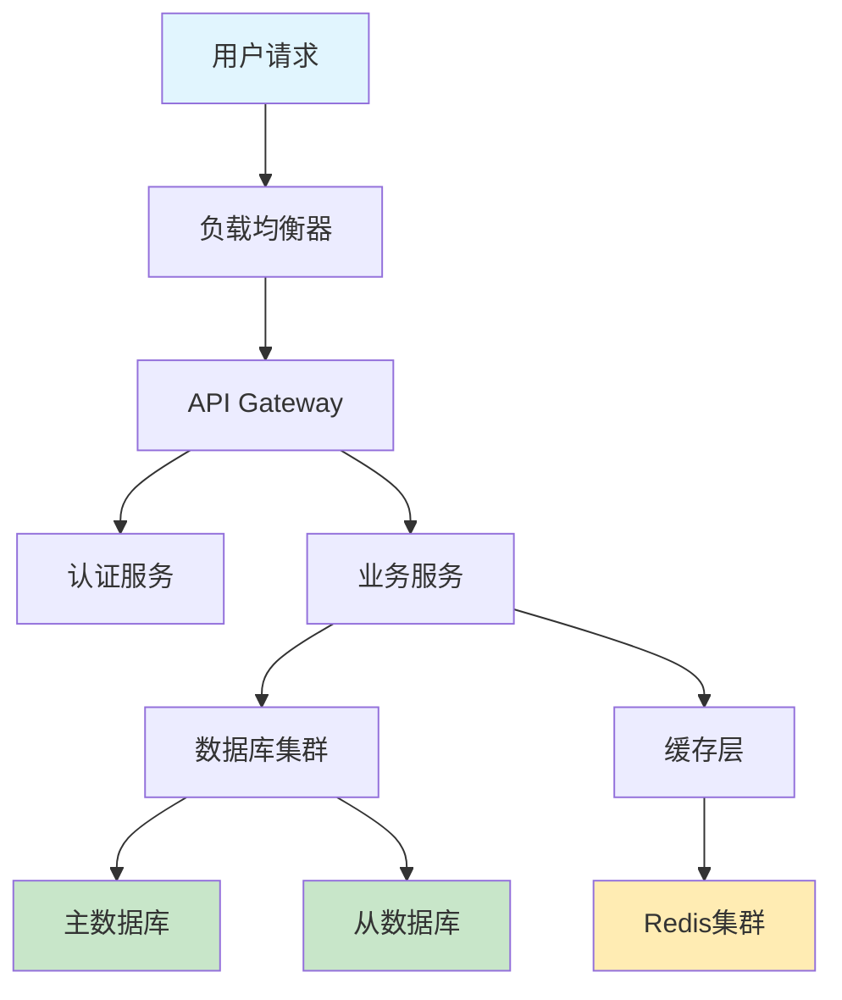

# Cursor 1.0 新功能完整使用指南

## 项目概述

Cursor 1.0 是一个重大版本更新，标志着 Cursor 从测试阶段过渡到成熟产品。作为基于 Visual Studio Code 的 AI 驱动代码编辑器，Cursor 1.0 引入了多项创新功能，旨在优化代码审查、调试和开发流程，显著提升开发效率。

本文档将详细介绍 Cursor 1.0 的所有新功能，包括使用方法、实际案例和最佳实践。

## 🚀 核心新功能

### 1. BugBot - 自动代码审查和修复

#### 功能描述
BugBot 是 Cursor 1.0 的核心亮点功能，能够自动分析 GitHub 上的 Pull Request（PR），识别潜在的代码错误和问题，并在 PR 上留下详细的评论。

#### 主要特性
- **自动审查**：每次 PR 更新时，BugBot 自动重新运行并分析代码变更
- **智能识别**：检测潜在的 bug、边界情况和最佳实践违规
- **一键修复**：通过"Fix in Cursor"按钮直接跳转到编辑器进行修复
- **深度分析**：基于上下文提供精确的修复建议

#### 使用方法

1. **设置 BugBot**
   ```bash
   # 1. 在 GitHub 上安装 Cursor BugBot 应用
   # 2. 在 Cursor 设置中连接 GitHub 账户
   # 3. 在项目设置中启用 BugBot
   ```

2. **配置审查规则**
   - 访问 Cursor Settings → BugBot
   - 设置审查严格程度（轻度/中度/严格）
   - 配置需要审查的文件类型
   - 设置忽略规则

3. **使用流程**
   - 创建或更新 Pull Request
   - BugBot 自动分析代码变更
   - 查看 BugBot 在 PR 中留下的评论
   - 点击"Fix in Cursor"按钮跳转修复

#### 实际案例

**案例1：API 错误处理审查**
```python
# 原始代码（BugBot 会标记的问题）
def get_user_data(user_id):
    response = requests.get(f"https://api.example.com/users/{user_id}")
    return response.json()  # 缺少错误处理

# BugBot 建议的修复
def get_user_data(user_id):
    try:
        response = requests.get(f"https://api.example.com/users/{user_id}")
        response.raise_for_status()  # 检查HTTP错误
        return response.json()
    except requests.exceptions.RequestException as e:
        logger.error(f"Failed to fetch user data: {e}")
        return None
```

**案例2：SQL 注入漏洞检测**
```python
# BugBot 标记的安全问题
def search_users(query):
    sql = f"SELECT * FROM users WHERE name LIKE '%{query}%'"  # SQL注入风险
    return execute_query(sql)

# BugBot 建议的安全修复
def search_users(query):
    sql = "SELECT * FROM users WHERE name LIKE %s"
    return execute_query(sql, (f'%{query}%',))  # 使用参数化查询
```

#### 最佳实践
- 定期检查 BugBot 的建议并学习常见问题模式
- 根据项目需求调整审查严格程度
- 建立团队编码规范，配合 BugBot 使用
- 对于 BugBot 的误报，可以添加忽略注释

### 2. Background Agent - 远程编码代理

#### 功能描述
Background Agent 是一个强大的远程编码代理，现已向所有用户开放。它可以在后台处理多个任务，让开发者专注于核心开发工作。

#### 主要特性
- **并行任务处理**：同时处理多个代码任务
- **远程执行**：在独立的远程环境中运行
- **实时监控**：随时查看状态和发送后续指令
- **智能切换**：可以随时接管或让 AI 继续工作

#### 使用方法

1. **启动 Background Agent**
   ```bash
   # 方法1：点击聊天界面中的云图标
   # 方法2：使用快捷键 Cmd/Ctrl+E（需关闭隐私模式）
   # 方法3：在命令面板中搜索 "Background Agent"
   ```

2. **任务分配**
   - 描述需要完成的任务
   - Agent 会自动分解为子任务
   - 可以同时运行多个 Agent 实例

3. **监控和控制**
   - 通过控制面板查看所有 Agent 状态
   - 发送后续指令或修改任务
   - 随时接管或停止 Agent

#### 实际案例

**案例1：自动化重构任务**
```typescript
// 任务描述：将旧的 class 组件重构为函数组件
// Background Agent 处理流程：

// 1. 分析现有代码结构
class OldComponent extends React.Component {
    constructor(props) {
        super(props);
        this.state = { count: 0 };
    }
    
    handleClick = () => {
        this.setState({ count: this.state.count + 1 });
    }
    
    render() {
        return <button onClick={this.handleClick}>{this.state.count}</button>;
    }
}

// 2. Agent 自动重构为函数组件
import React, { useState } from 'react';

const NewComponent: React.FC = () => {
    const [count, setCount] = useState(0);
    
    const handleClick = () => {
        setCount(count + 1);
    };
    
    return <button onClick={handleClick}>{count}</button>;
};

export default NewComponent;
```

**案例2：API 集成开发**
```python
# 任务：为新的支付系统创建完整的 API 集成

# Agent 自动生成的文件结构：
payment_system/
├── __init__.py
├── client.py          # API 客户端
├── models.py          # 数据模型
├── exceptions.py      # 异常处理
├── utils.py          # 工具函数
└── tests/            # 测试文件
    ├── test_client.py
    └── test_models.py

# Agent 生成的主要代码：
class PaymentClient:
    def __init__(self, api_key: str, base_url: str):
        self.api_key = api_key
        self.base_url = base_url
        self.session = requests.Session()
        self.session.headers.update({'Authorization': f'Bearer {api_key}'})
    
    async def create_payment(self, amount: float, currency: str) -> Payment:
        # 实现支付创建逻辑
        pass
    
    async def get_payment_status(self, payment_id: str) -> PaymentStatus:
        # 实现支付状态查询
        pass
```

#### 最佳实践
- 将复杂任务分解为小的、明确的子任务
- 定期检查 Agent 的进度并提供反馈
- 对于关键代码，始终进行人工审查
- 合理利用多个 Agent 并行处理不同模块

### 3. Jupyter Notebook 支持

#### 功能描述
Cursor 1.0 新增对 Jupyter Notebook 的完整支持，Agent 可以直接在 Jupyter 内创建和编辑多个单元格，显著改善数据科学和机器学习的开发体验。

#### 主要特性
- **直接编辑**：在 Cursor 中直接编辑 .ipynb 文件
- **智能单元格管理**：Agent 自动创建和组织代码单元格
- **数据分析优化**：专为数据科学工作流程优化
- **模型支持**：目前支持 Claude Sonnet 模型

#### 使用方法

1. **打开 Jupyter 文件**
   ```bash
   # 直接在 Cursor 中打开 .ipynb 文件
   # 或创建新的 Jupyter notebook
   ```

2. **AI 辅助编程**
   - 使用 Agent 生成数据分析代码
   - AI 自动创建和组织单元格
   - 智能处理数据可视化

#### 实际案例

**案例1：数据分析工作流**
```python
# Agent 自动生成的数据分析 Jupyter Notebook

# Cell 1: 导入必要的库
import pandas as pd
import numpy as np
import matplotlib.pyplot as plt
import seaborn as sns
from sklearn.model_selection import train_test_split
from sklearn.ensemble import RandomForestClassifier
from sklearn.metrics import classification_report, confusion_matrix

# Cell 2: 数据加载和基本探索
# Agent 根据用户描述自动生成
df = pd.read_csv('sales_data.csv')
print(f"数据集形状: {df.shape}")
print(f"缺失值情况:\n{df.isnull().sum()}")
df.head()

# Cell 3: 数据清洗
# Agent 识别数据质量问题并生成清洗代码
df['date'] = pd.to_datetime(df['date'])
df['revenue'] = pd.to_numeric(df['revenue'], errors='coerce')
df = df.dropna(subset=['revenue'])
df['month'] = df['date'].dt.month
df['quarter'] = df['date'].dt.quarter

# Cell 4: 数据可视化
# Agent 自动生成相关图表
plt.figure(figsize=(15, 10))

plt.subplot(2, 2, 1)
sns.histplot(df['revenue'], bins=50)
plt.title('Revenue Distribution')

plt.subplot(2, 2, 2)
monthly_revenue = df.groupby('month')['revenue'].sum()
plt.plot(monthly_revenue.index, monthly_revenue.values)
plt.title('Monthly Revenue Trend')

plt.subplot(2, 2, 3)
sns.boxplot(data=df, x='quarter', y='revenue')
plt.title('Revenue by Quarter')

plt.subplot(2, 2, 4)
top_products = df.groupby('product')['revenue'].sum().sort_values(ascending=False).head(10)
plt.barh(range(len(top_products)), top_products.values)
plt.yticks(range(len(top_products)), top_products.index)
plt.title('Top 10 Products by Revenue')

plt.tight_layout()
plt.show()
```

**案例2：机器学习模型开发**
```python
# Agent 创建完整的机器学习工作流

# Cell 1: 特征工程
def create_features(df):
    """Agent 自动生成的特征工程函数"""
    features = df.copy()
    
    # 时间特征
    features['day_of_week'] = features['date'].dt.dayofweek
    features['is_weekend'] = features['day_of_week'].isin([5, 6])
    features['days_since_launch'] = (features['date'] - features['date'].min()).dt.days
    
    # 统计特征
    features['rolling_mean_7d'] = features.groupby('product')['revenue'].transform(
        lambda x: x.rolling(window=7, min_periods=1).mean()
    )
    
    return features

# Cell 2: 模型训练
features_df = create_features(df)
X = features_df[['day_of_week', 'is_weekend', 'days_since_launch', 'rolling_mean_7d']]
y = features_df['high_revenue'] = (features_df['revenue'] > features_df['revenue'].quantile(0.8))

X_train, X_test, y_train, y_test = train_test_split(X, y, test_size=0.2, random_state=42)

model = RandomForestClassifier(n_estimators=100, random_state=42)
model.fit(X_train, y_train)

# Cell 3: 模型评估
y_pred = model.predict(X_test)
print("分类报告:")
print(classification_report(y_test, y_pred))

# 特征重要性可视化
feature_importance = pd.DataFrame({
    'feature': X.columns,
    'importance': model.feature_importances_
}).sort_values('importance', ascending=False)

plt.figure(figsize=(10, 6))
sns.barplot(data=feature_importance, x='importance', y='feature')
plt.title('Feature Importance')
plt.show()
```

### 4. Memories - 项目记忆功能

#### 功能描述
Memories 是一个革命性的功能，让 Cursor 能够记住对话中的重要信息，并在未来的会话中引用。这大大提高了长期项目的开发效率。

#### 主要特性
- **项目级存储**：记忆按项目单独存储
- **个人化管理**：每个开发者有独立的记忆库
- **智能引用**：AI 自动识别相关的历史信息
- **可管理性**：可以在设置中查看和管理所有记忆

#### 使用方法

1. **启用 Memories**
   ```bash
   # 进入 Settings → Rules
   # 启用 "Memories (Beta)" 功能
   ```

2. **创建记忆**
   - 在对话中，AI 会自动识别重要信息并存储
   - 也可以手动标记需要记住的信息
   - 使用特定命令创建记忆：`/remember [信息]`

3. **使用记忆**
   - AI 会自动在相关对话中引用历史记忆
   - 可以主动询问："你还记得我们之前讨论的登录系统吗？"

#### 实际案例

**案例1：项目架构决策记忆**
```typescript
// 第一次对话 - AI 会记住这些架构决策
/* 
对话记录：
用户：我们决定使用 Next.js + TypeScript + Prisma + PostgreSQL 来构建这个电商平台
AI：好的，我已经记住了你们的技术栈选择：
- 前端框架：Next.js with TypeScript
- ORM：Prisma
- 数据库：PostgreSQL
- 项目类型：电商平台

我还记住了你们的文件夹结构偏好：
- 使用 src/ 目录
- 组件采用 PascalCase 命名
- 工具函数放在 utils/ 目录
*/

// 几天后的对话 - AI 自动引用之前的记忆
/* 
用户：我需要创建一个产品页面组件
AI：基于我们之前讨论的架构（Next.js + TypeScript + Prisma），我来为你创建一个产品页面组件。
我记得你们使用 PascalCase 命名，所以我会创建 ProductPage.tsx。
*/

// AI 生成的代码会自动符合之前记住的规范
interface Product {
  id: string;
  name: string;
  price: number;
  description: string;
  imageUrl: string;
}

const ProductPage: React.FC<{ productId: string }> = ({ productId }) => {
  // 使用之前讨论过的 Prisma 查询模式
  const [product, setProduct] = useState<Product | null>(null);
  
  useEffect(() => {
    fetchProduct(productId).then(setProduct);
  }, [productId]);
  
  return (
    <div className="product-page">
      {/* 组件内容 */}
    </div>
  );
};
```

**案例2：API 设计模式记忆**
```python
# 第一次讨论 API 设计模式时的记忆
"""
记忆内容：
- API 响应格式统一使用 {"success": boolean, "data": any, "message": string}
- 错误处理使用自定义异常类
- 所有 API 端点都需要认证装饰器
- 使用 FastAPI + Pydantic 进行数据验证
"""

# 几周后创建新 API 时，AI 自动应用记住的模式
from fastapi import APIRouter, Depends, HTTPException
from pydantic import BaseModel
from .auth import get_current_user
from .exceptions import CustomAPIException

router = APIRouter()

class CreateOrderRequest(BaseModel):
    product_id: str
    quantity: int
    
class OrderResponse(BaseModel):
    success: bool
    data: dict = None
    message: str

@router.post("/orders", response_model=OrderResponse)
async def create_order(
    request: CreateOrderRequest,
    current_user = Depends(get_current_user)  # 记住的认证模式
):
    try:
        # 业务逻辑
        order = await create_order_service(request, current_user)
        
        # 记住的统一响应格式
        return OrderResponse(
            success=True,
            data={"order_id": order.id, "status": order.status},
            message="订单创建成功"
        )
    except CustomAPIException as e:  # 记住的异常处理模式
        return OrderResponse(
            success=False,
            message=str(e)
        )
```

### 5. MCP 一键安装和 OAuth 支持

#### 功能描述
MCP（Managed Codebase Platform）一键安装功能简化了开发环境的配置过程，通过 OAuth 认证，开发者可以一键完成复杂环境的设置。

#### 主要特性
- **一键安装**：简化 MCP 服务器配置流程
- **OAuth 集成**：支持安全的第三方服务认证
- **官方服务器**：提供精选的官方 MCP 服务器列表
- **开发者友好**：MCP 开发者可以轻松添加"Add to Cursor"按钮

#### 使用方法

1. **安装 MCP 服务器**
   ```bash
   # 访问 docs.cursor.com/tools 查看可用服务器
   # 点击感兴趣的服务器的"Add to Cursor"按钮
   # 系统会自动完成安装和配置
   ```

2. **OAuth 认证**
   - 选择需要认证的服务
   - 点击授权按钮
   - 完成 OAuth 流程
   - 服务自动集成到 Cursor

#### 实际案例

**案例1：GitHub 集成**
```javascript
// 一键安装 GitHub MCP 服务器后的功能
// AI 可以直接访问和操作 GitHub 仓库

// 用户：请帮我创建一个新的 issue 模板
// AI 自动生成并创建 issue 模板文件

// .github/ISSUE_TEMPLATE/bug_report.md
---
name: Bug报告
about: 创建一个bug报告来帮助我们改进
title: '[BUG] '
labels: bug
assignees: ''
---

**描述bug**
清晰简洁地描述这个bug是什么。

**重现步骤**
重现此行为的步骤：
1. 转到 '...'
2. 点击 '....'
3. 滚动到 '....'
4. 看到错误

**预期行为**
简洁明了地描述你期望发生的事情。

**截图**
如果适用的话，添加截图来帮助解释你的问题。

**环境信息：**
 - OS: [e.g. iOS]
 - Browser [e.g. chrome, safari]
 - Version [e.g. 22]

// AI 还可以自动创建和管理 issues、PR 等
await github.issues.create({
  owner: 'your-username',
  repo: 'your-repo',
  title: 'Add user authentication system',
  body: 'Implement JWT-based authentication with refresh tokens',
  labels: ['enhancement', 'high-priority']
});
```

**案例2：数据库集成**
```python
# 安装数据库 MCP 服务器后的功能
# AI 可以直接操作数据库

# 用户：帮我分析最近一个月的销售趋势
# AI 自动执行数据库查询和分析

import pandas as pd
from datetime import datetime, timedelta

# AI 自动生成的数据库查询
query = """
SELECT 
    DATE(created_at) as sale_date,
    COUNT(*) as order_count,
    SUM(total_amount) as daily_revenue,
    AVG(total_amount) as avg_order_value
FROM orders 
WHERE created_at >= %s 
    AND status = 'completed'
GROUP BY DATE(created_at)
ORDER BY sale_date DESC
"""

# 执行查询
start_date = datetime.now() - timedelta(days=30)
results = execute_query(query, (start_date,))

# 生成分析报告
df = pd.DataFrame(results)
print("最近30天销售趋势分析:")
print(f"总订单数: {df['order_count'].sum()}")
print(f"总收入: ${df['daily_revenue'].sum():,.2f}")
print(f"平均每日收入: ${df['daily_revenue'].mean():,.2f}")
print(f"平均订单价值: ${df['avg_order_value'].mean():.2f}")

# 生成趋势图
import matplotlib.pyplot as plt
plt.figure(figsize=(12, 6))
plt.plot(df['sale_date'], df['daily_revenue'])
plt.title('Daily Revenue Trend (Last 30 Days)')
plt.xlabel('Date')
plt.ylabel('Revenue ($)')
plt.xticks(rotation=45)
plt.tight_layout()
plt.show()
```

### 6. 丰富的聊天响应

#### 功能描述
Cursor 1.0 增强了聊天界面的可视化能力，可以在对话中直接渲染 Mermaid 图表、Markdown 表格等可视化内容。

#### 主要特性
- **Mermaid 图表支持**：流程图、时序图、类图等
- **Markdown 表格**：复杂数据的表格展示
- **内联渲染**：直接在聊天界面中显示
- **交互式内容**：支持可点击和可交互的元素

#### 实际案例

**案例1：系统架构图**


**案例2：数据分析表格**

| 指标 | Q1 2024 | Q2 2024 | Q3 2024 | 增长率 |
|------|---------|---------|---------|--------|
| 用户数 | 10,000 | 15,000 | 22,000 | +46.7% |
| 收入 | $50,000 | $75,000 | $110,000 | +46.7% |
| 转化率 | 2.5% | 3.2% | 4.1% | +28.1% |
| 客户满意度 | 4.2 | 4.5 | 4.7 | +11.9% |

### 7. 新的设置和仪表板

#### 功能描述
全新设计的设置界面和仪表板，提供更直观的使用统计和配置管理。

#### 主要特性
- **使用分析**：个人和团队的详细使用统计
- **模型统计**：按工具和模型分类的详细统计
- **个人资料管理**：更新显示名称和个人信息
- **团队管理**：团队管理员可以访问更多控制选项

## 📋 快速入门指南

### 1. 安装和设置

```bash
# 下载 Cursor 1.0
# 访问 cursor.com 下载最新版本

# 登录账户
# 使用 GitHub 或邮箱登录

# 配置基本设置
# Settings → General → 配置主题和快捷键
```

### 2. 基本使用流程

1. **创建新项目**
   - 选择项目模板
   - 配置技术栈
   - 设置项目规则

2. **使用 AI 功能**
   - Cmd+L：打开聊天
   - Cmd+K：内联编辑
   - Cmd+E：背景代理
   - @符号：引用文件和文档

3. **代码审查流程**
   - 启用 BugBot
   - 创建 Pull Request
   - 查看和处理 BugBot 建议
   - 一键修复问题

### 3. 团队协作设置

```typescript
// .cursor/rules 文件示例
// 团队编码规范
{
  "language": "typescript",
  "rules": {
    "naming": {
      "components": "PascalCase",
      "functions": "camelCase",
      "constants": "UPPER_SNAKE_CASE"
    },
    "structure": {
      "maxFileLength": 300,
      "preferFunctionalComponents": true,
      "useStrictMode": true
    },
    "imports": {
      "sortOrder": ["react", "next", "third-party", "local"],
      "groupSeparation": true
    }
  }
}
```

## 🔧 高级配置

### 1. 自定义 MCP 服务器

```json
// ~/.cursor/mcp.json
{
  "servers": {
    "custom-api": {
      "command": "node",
      "args": ["./custom-mcp-server.js"],
      "env": {
        "API_KEY": "${API_KEY}"
      }
    }
  }
}
```

### 2. 高级 BugBot 配置

```yaml
# .cursor/bugbot.yml
rules:
  security:
    - sql_injection: high
    - xss_prevention: high
    - auth_validation: medium
  
  performance:
    - n_plus_one_queries: high
    - memory_leaks: medium
    - inefficient_loops: low
  
  style:
    - naming_conventions: medium
    - code_complexity: low
    - documentation: low

ignore_patterns:
  - "*.test.js"
  - "migration/*"
  - "legacy/*"
```

### 3. Memories 配置

```javascript
// 自定义记忆规则
const memoryConfig = {
  retention: {
    projectDecisions: '1 year',
    codePatterns: '6 months',
    bugFixes: '3 months'
  },
  categories: [
    'architecture',
    'api-design',
    'ui-patterns',
    'performance-optimizations'
  ],
  autoSave: true,
  shareWithTeam: false
};
```

## 💡 最佳实践和技巧

### 1. 提高 AI 协作效率

- **明确的任务描述**：详细描述需求和期望结果
- **渐进式开发**：将复杂任务分解为小步骤
- **及时反馈**：为 AI 提供反馈以改进后续输出
- **代码审查**：始终对 AI 生成的代码进行人工审查

### 2. BugBot 优化技巧

- **配置合适的严格级别**：根据项目阶段调整
- **建立忽略规则**：对于已知的非问题添加忽略
- **学习模式识别**：从 BugBot 建议中学习常见问题
- **团队规范统一**：建立团队统一的编码规范

### 3. Background Agent 使用策略

- **任务并行化**：合理分配多个 Agent 处理不同模块
- **监控资源使用**：注意 Agent 的资源消耗
- **版本控制集成**：确保 Agent 修改的代码被正确提交
- **安全考虑**：对敏感操作始终进行人工确认

## 🚨 常见问题和解决方案

### 1. BugBot 相关问题

**问题**：BugBot 没有在 PR 中留下评论
**解决方案**：
- 检查 GitHub 集成是否正确配置
- 确认项目中启用了 BugBot
- 验证 PR 中是否有代码变更

**问题**：BugBot 建议过于严格
**解决方案**：
- 调整设置中的严格级别
- 添加项目特定的忽略规则
- 配置文件类型过滤

### 2. Background Agent 问题

**问题**：Agent 任务执行失败
**解决方案**：
- 检查网络连接状态
- 验证项目依赖是否完整
- 重新启动 Agent 服务

**问题**：Agent 修改了不应该修改的文件
**解决方案**：
- 使用 .cursorignore 文件排除敏感文件
- 明确指定 Agent 的工作范围
- 启用文件修改确认提示

### 3. Memories 功能问题

**问题**：AI 没有记住之前的对话内容
**解决方案**：
- 确认 Memories 功能已启用
- 检查项目设置中的记忆配置
- 手动使用 /remember 命令存储重要信息

## 📊 性能监控和优化

### 1. 使用统计分析

```typescript
// 访问新的仪表板查看详细统计
interface UsageStats {
  totalRequests: number;
  modelUsage: {
    [model: string]: {
      requests: number;
      tokens: number;
      cost: number;
    };
  };
  featureUsage: {
    chat: number;
    edit: number;
    backgroundAgent: number;
    bugBot: number;
  };
  dailyTrends: {
    date: string;
    requests: number;
  }[];
}
```

### 2. 性能优化建议

- **合理使用模型**：根据任务复杂度选择合适的模型
- **批量处理**：将相关任务组合处理
- **缓存策略**：利用 Memories 功能减少重复询问
- **网络优化**：确保稳定的网络连接

## 🎯 总结

Cursor 1.0 是一个重大的里程碑版本，引入的新功能显著提升了 AI 辅助编程的体验：

1. **BugBot** 自动化了代码审查流程，提高了代码质量
2. **Background Agent** 实现了真正的 AI 编程助手
3. **Jupyter 支持** 增强了数据科学工作流程
4. **Memories** 让 AI 具备了项目记忆能力
5. **MCP 集成** 简化了开发环境配置
6. **可视化聊天** 提供了更丰富的交互体验

这些功能的结合使 Cursor 1.0 成为了目前最先进的 AI 编程工具之一，为开发者提供了前所未有的智能编程体验。

## 🔗 相关资源

- [Cursor 官网](https://cursor.com)
- [BugBot 文档](https://docs.cursor.com/bugbot)
- [MCP 工具列表](https://docs.cursor.com/tools)
- [Deep Links 生成器](https://docs.cursor.com/deeplinks)
- [Background Agent 指南](https://docs.cursor.com/background-agent)

---

*本文档持续更新中，如有问题或建议，欢迎通过 GitHub Issues 反馈。*
